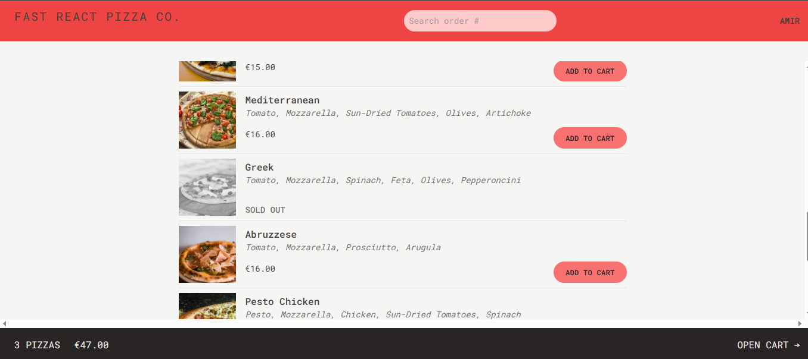
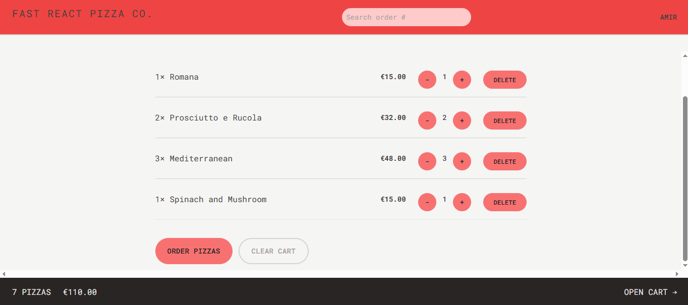
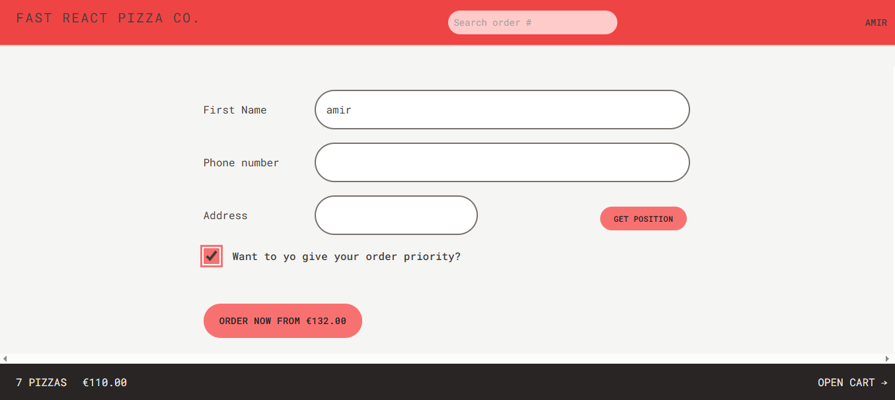

# 🍕 Fast React Pizza Co.

A modern, full-featured pizza ordering application built with React, Redux Toolkit, and React Router. Order delicious pizzas with real-time order tracking, geolocation support, and priority delivery options.

## ✨ Features

- **Browse Menu** - View available pizzas with ingredients and prices
- **Shopping Cart** - Add, remove, and adjust pizza quantities
- **User Authentication** - Simple username-based system
- **Order Tracking** - Search and track orders by ID
- **Geolocation** - Auto-fill delivery address using your current location
- **Priority Orders** - Mark orders as priority for faster delivery
- **Real-time Updates** - Live order status and delivery estimates
- **Responsive Design** - Seamless experience across all devices

## 🚀 Tech Stack

- **React 18** - UI library
- **Redux Toolkit** - State management
- **React Router v6** - Navigation and routing
- **Tailwind CSS** - Styling and responsive design
- **Vite** - Build tool and dev server
- **ESLint** - Code linting

## Screenshots

- **Menu** -
  
- **Cart** -
  
- **Order** -
  

## 📦 Installation

1. Clone the repository:

```bash
git clone <repository-url>
cd fast-react-pizza
```

2. Install dependencies:

```bash
npm install
```

3. Start the development server:

```bash
npm run dev
```

4. Open your browser and navigate to the local development URL (typically `http://localhost:5173`)

## 🛠️ Available Scripts

- `npm run dev` - Start development server
- `npm run build` - Build for production
- `npm run preview` - Preview production build
- `npm run lint` - Run ESLint

## 📁 Project Structure

```
src/
├── features/
│   ├── cart/          # Shopping cart functionality
│   ├── menu/          # Pizza menu display
│   ├── order/         # Order creation and tracking
│   └── user/          # User management
├── services/          # API integrations
│   ├── apiRestaurant.js
│   └── apiGeocoding.js
├── ui/                # Reusable UI components
├── utils/             # Helper functions
├── App.jsx            # Main app component with routing
├── store.js           # Redux store configuration
└── main.jsx           # Application entry point
```

## 🎯 Key Functionality

### Order Flow

1. Enter your name to start ordering
2. Browse the pizza menu
3. Add pizzas to your cart with quantity controls
4. Proceed to checkout
5. Enter contact details and delivery address
6. Optionally enable priority delivery (+20% fee)
7. Submit order and receive tracking ID
8. Track order status in real-time

### State Management

- **User Slice** - Username and geolocation data
- **Cart Slice** - Shopping cart items and calculations

### API Integration

The app connects to a live backend API for:

- Fetching menu items
- Creating orders
- Retrieving order details
- Updating order priority

## 🎨 Styling

The project uses Tailwind CSS with a custom configuration:

- Custom color palette with red/stone theme
- Roboto Mono font family
- Responsive breakpoints
- Custom loader animation

## 🔧 Configuration Files

- `vite.config.js` - Vite configuration with ESLint plugin
- `tailwind.config.js` - Tailwind CSS customization
- `.eslintrc.cjs` - ESLint rules using react-app config
- `postcss.config.js` - PostCSS with Tailwind and Autoprefixer

## 🌐 Browser Support

Supports all modern browsers with ES2021 features.

## 📝 License

This project is part of a React learning course and is available for educational purposes.

## 🤝 Contributing

Feel free to fork this project and submit pull requests for any improvements.

## 📞 Support

For issues or questions, please open an issue in the repository.

---

**Enjoy your pizza! 🍕**
